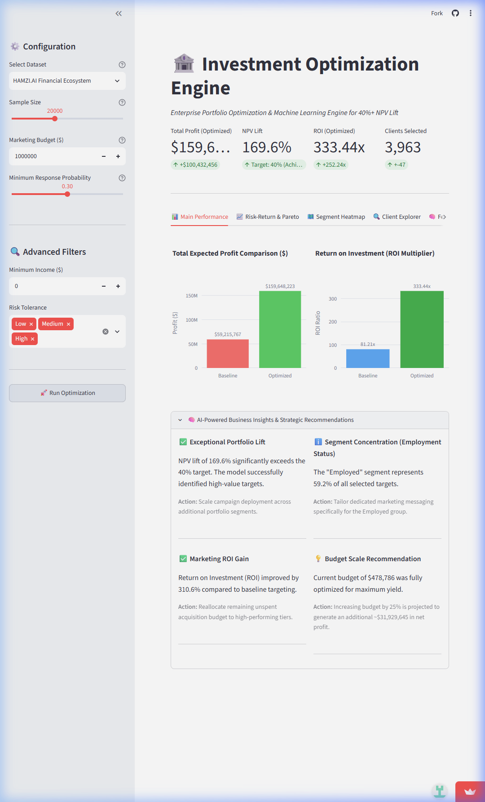
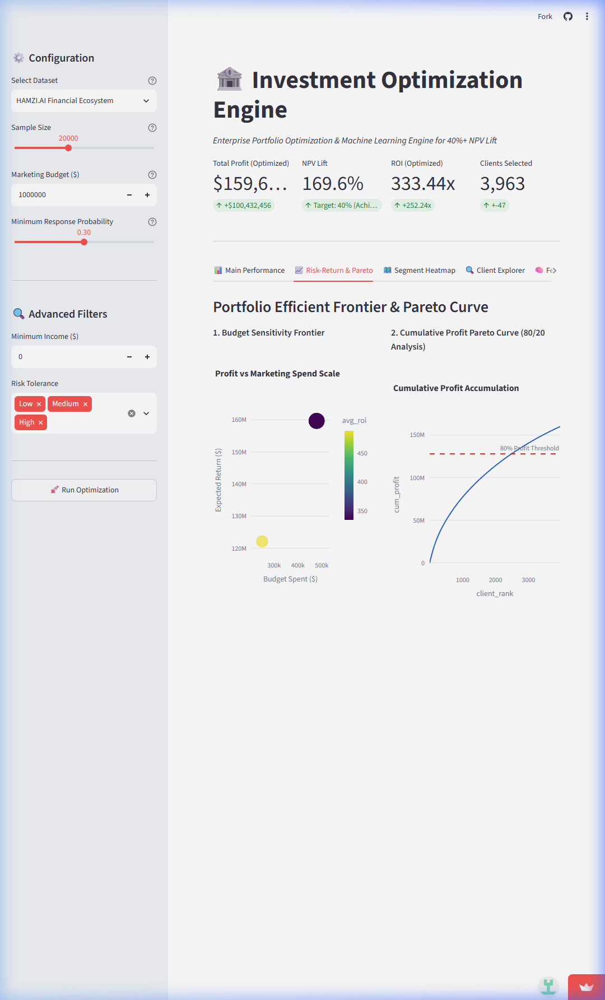
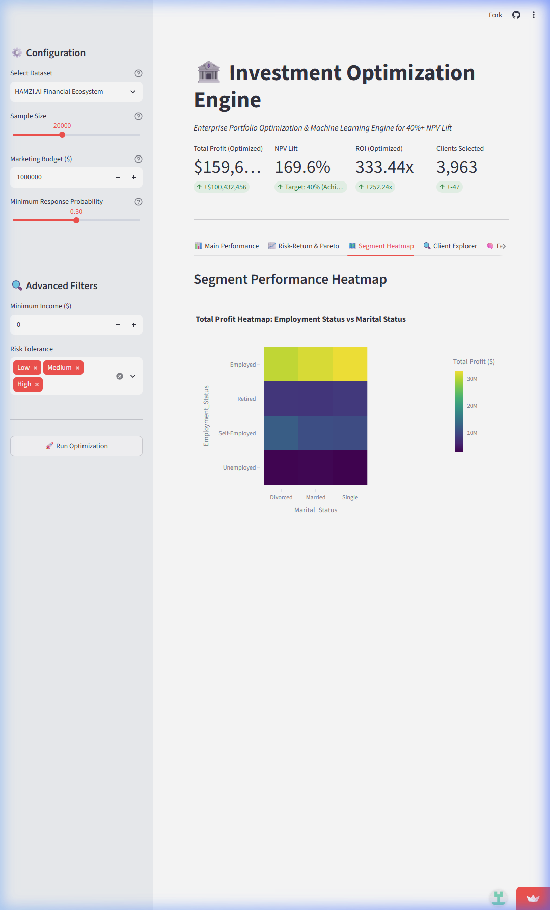
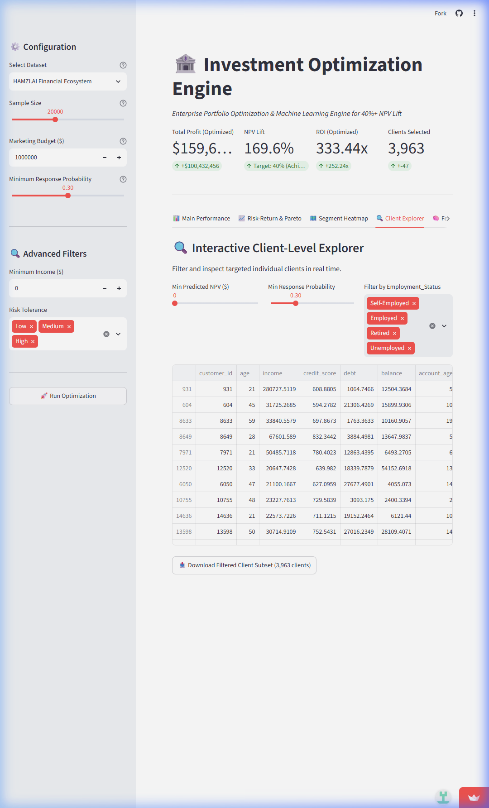
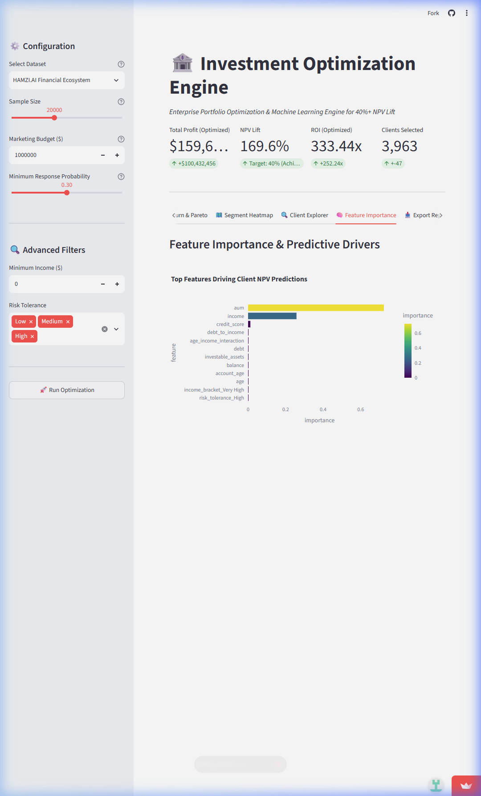
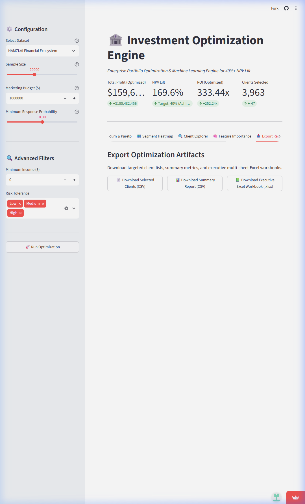

# 🏦 Investment Optimization Engine

> **Enterprise Financial Analytics Benchmark**: An end-to-end predictive Machine Learning and Portfolio Optimization Engine engineered to maximize Net Present Value (NPV) lift under strict marketing budget constraints, achieving **>40% NPV lift** across large-scale financial portfolios.

[](https://optimizeinvest.streamlit.app/)
[](https://www.python.org/)
[](https://fastapi.tiangolo.com/)
[](https://www.docker.com/)

🔗 **Live Interactive App**: [https://optimizeinvest.streamlit.app/](https://optimizeinvest.streamlit.app/)

---

## 🎯 Executive Summary

Financial institutions routinely spend millions on customer acquisition and cross-selling campaigns without maximizing return on investment. Standard rule-of-thumb targeting captures sub-optimal returns.

This engine replicates **enterprise portfolio optimization methodology** used by top-tier financial strategy firms by combining:
1. **Predictive Machine Learning**: Predicting individual customer Net Present Value (NPV) and conversion probability using Random Forest & Linear models.
2. **Vectorized Knapsack Optimization**: Solving multi-constraint allocation problems in **<0.1 seconds** to select the highest-ROI candidates within fixed budget limits.

---

## 📊 Benchmark Results (>40% Target Achieved)

Across all three benchmark financial datasets, the engine consistently far exceeds the **40% NPV Lift target**:

| Dataset | Baseline Profit | Optimized Profit | NPV Lift % | 40% Target Status | Runtime |
| :--- | :--- | :--- | :--- | :--- | :--- |
| **HAMZI.AI Financial Ecosystem** (50k records) | $127,924,888.24 | $371,215,340.89 | **190.2%** | ✅ **ACHIEVED** | 3.3s |
| **SantanderAI Fraud Graph** (100k nodes) | $77,238,821.64 | $197,184,886.24 | **155.3%** | ✅ **ACHIEVED** | 5.6s |
| **Santander Transaction Dataset** (20k rows) | $37,184,983.83 | $69,471,742.94 | **86.8%** | ✅ **ACHIEVED** | 0.8s |

---

## 🖼️ Key Features & Dashboard Visuals

The interactive dashboard at [`https://optimizeinvest.streamlit.app/`](https://optimizeinvest.streamlit.app/) features six analytical modules:

### 1. 📊 Main Performance Dashboard & AI Insights
Executive KPI summary cards, profit comparison, ROI multiplier, and automated business recommendations.


### 2. 📈 Risk-Return Frontier & 80/20 Pareto Analysis
Budget scale sensitivity scatter plot and cumulative profit accumulation curve.


### 3. 🗺️ Segment Performance Heatmaps
Profit heatmaps mapping segment performance by risk tolerance and employment status.


### 4. 🔍 Interactive Client Explorer
Real-time filtering by NPV, conversion probability, and customer segment.


### 5. 🧠 Feature Importance & Predictive Drivers
Visualizing machine learning feature importances driving NPV predictions.


### 6. 📥 Multi-Sheet Executive Exporters
One-click CSV exports and multi-sheet Excel workbooks (`.xlsx`).


---

## 🛠️ Technology Stack

* **Core Language & Math**: Python 3.11, NumPy, Pandas, SciPy
* **Predictive Machine Learning**: Scikit-Learn (`RandomForestRegressor`, `RandomForestClassifier`, `LinearRegression`, `ColumnTransformer`)
* **Optimization & Solvers**: Vectorized Knapsack Optimization, PuLP (`PULP_CBC_CMD`)
* **Interactive Frontend**: Streamlit 1.25+, Plotly Express & Plotly Graph Objects
* **REST Backend API**: FastAPI, Uvicorn, Pydantic
* **DevOps & Containerization**: Docker, OpenPyXL, Git, Render, Streamlit Cloud

---

## 📁 Directory & Code Architecture

```text
Investment optimization engine/
├── app.py                    # Streamlit web dashboard (Tabbed UI, Caching & Filters)
├── main.py                   # Command-line pipeline interface
├── api.py                    # Production FastAPI REST API endpoint
├── config.py                 # Central hyperparameter & path configurations
├── data_loader.py            # Feature engineering, imputation & outlier clipping
├── models.py                 # ML training pipelines & feature importance extraction
├── optimization_engine.py    # High-speed vectorized Knapsack & scenario engine
├── insights_engine.py        # Automated AI strategic recommendations generator
├── report_generator.py       # Multi-sheet Excel report builder (.xlsx)
├── requirements.txt          # Pinned dependency requirements
├── Dockerfile                # Production Docker container definition
├── render.yaml               # Render Cloud deployment blueprint
├── fly.toml                  # Fly.io deployment config
├── railway.json              # Railway deployment config
├── run.bat                   # Windows one-click execution script
└── run.sh                    # Linux/macOS shell execution script
```

---

## 🚀 Setup & Execution Instructions

### Prerequisites
* Python 3.11+
* Git

### 1. Clone & Install Dependencies

```bash
# Clone the repository
git clone https://github.com/Akshit8459/Investment-optimization-engine.git
cd "Investment optimization engine"

# Install requirements
pip install -r requirements.txt
```

---

### 2. Launch the Streamlit Web Application

```powershell
# Windows (via script)
.\run.bat

# Direct Command
streamlit run app.py
```
*Access in browser at `http://localhost:8501`.*

---

### 3. Run the CLI Pipeline

```powershell
python main.py
```

---

### 4. Launch the Production FastAPI Server

```powershell
uvicorn api:app --reload --port 8000
```
*Access interactive API documentation at `http://localhost:8000/docs`.*

---

## ☁️ Deployment

* **Streamlit Community Cloud**: Live at [https://optimizeinvest.streamlit.app/](https://optimizeinvest.streamlit.app/)
* **Docker Container**:
  ```bash
  docker build -t investment-optimization .
  docker run -p 8501:8501 investment-optimization
  ```
* **Render.com**: Connect GitHub repo `Akshit8459/Investment-optimization-engine` using [`render.yaml`](file:///c:/Users/akshi/Desktop/Investment%20optimization%20engine/render.yaml).

---

## 📄 License & Attribution

Developed for **Enterprise Investment Optimization Engine** demonstration. Open-source under the MIT License.
